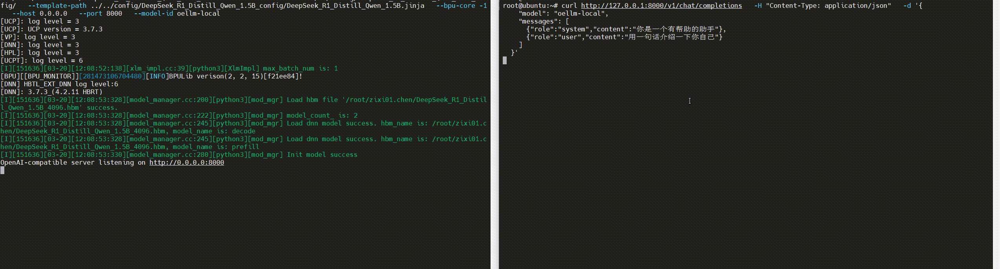
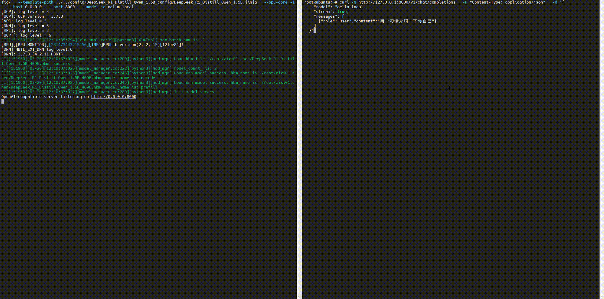

# OpenAI 协议兼容推理 Server（oellm/xlm）

本目录新增了 `openai_server.py`，它会在启动时调用 `xlm_init` 初始化模型，并提供 OpenAI 兼容接口：

- `GET /health`
- `GET /v1/models`
- `POST /v1/chat/completions`（支持 `stream=true` 的 SSE）

# 准备工作

- D-Robotics_LLM_S100 开发工具包
```shell
wget https://d-robotics-aitoolchain.oss-cn-beijing.aliyuncs.com/llm_s100/1.0.0/D-Robotics_LLM_S100_1.0.0_SDK.tar.gz
```

- D-Robotics_LLM_S100 用户手册
```shell
wget https://d-robotics-aitoolchain.oss-cn-beijing.aliyuncs.com/llm_s100/1.0.0/D-Robotics_LLM_S100_1.0.0_Doc.zip
```

- 在 RDK S100 / RDK S100P 运行 LLM 大模型 (参考用户手册)

更多使用参考 [地瓜机器人LLM工具链](https://developer.d-robotics.cc/rdk_doc/rdk_s/Advanced_development/toolchain_development/LLM_Toolchain)

- 下载本仓库

```shell
cd D-Robotics_LLM_S100_1.0.0_SDK/oellm_runtime/example/oellm_run
git clone https://github.com/D-Robotics/oellm_server.git
```

# 服务端启动

建议在 **板端 Linux** 环境运行（需要能加载 `oellm_runtime/lib/libxlm.so` 及其依赖）。

示例（Qwen2.5 / InternLM2 / DeepSeek 这类纯文本模型）：

```shell
# export LIBXLM_PATH=/path/to/oellm_runtime/lib/libxlm.so  # 可选；不设时脚本会按相对目录自动推断
export LD_LIBRARY_PATH=/path/to/oellm_runtime/lib:$LD_LIBRARY_PATH
lib=/home/root/llm/D-Robotics_LLM_{version}/oellm_runtime/lib 
export LD_LIBRARY_PATH=${lib}:${LD_LIBRARY_PATH}

python3 openai_server.py \
  --model-type 7 \
  --hbm-path /path/to/model.hbm \
  --tokenizer-dir /path/to/tokenizer_dir \
  --template-path /path/to/chat_template.txt \
  --bpu-core -1 \
  --host 0.0.0.0 \
  --port 8000 \
  --model-id oellm-local
```

当前仅保留 1 个环境变量：

- `LIBXLM_PATH`：`libxlm.so` 文件路径；可传目录（会自动补 `libxlm.so`），也可不设置（默认自动指向 `oellm_runtime/lib/libxlm.so`）

其余参数全部通过命令行传入：

- `--model-type`：必填，支持 `0/1/4/7`
- `--hbm-path`：文本模型（`1/4/7`）必填
- `--tokenizer-dir`：文本模型（`1/4/7`）必填
- `--config-path`：`model-type=0`（INTERNVL）必填
- `--template-path`：可选
- `--bpu-core`：`-1/0/1/2/3`，默认 `-1`
- `--host`：默认 `0.0.0.0`
- `--port`：默认 `8000`
- `--model-id`：默认 `oellm-local`

### Deepseek

```shell
# 修改硬件寄存器的值使设备调整为性能模式
sh set_performance_mode.sh

# 设置环境变量
lib=/home/root/llm/D-Robotics_LLM_S100_1.0.0_SDK/oellm_runtime/lib 
export LD_LIBRARY_PATH=${lib}:${LD_LIBRARY_PATH}

python3 oellm_server/openai_server.py \
  --model-type 1 \
  --hbm-path ../../model/DeepSeek_R1_Distill_Qwen_1.5B_4096.hbm \
  --tokenizer-dir ../../config/DeepSeek_R1_Distill_Qwen_1.5B_config/ \
  --template-path ../../config/DeepSeek_R1_Distill_Qwen_1.5B_config/DeepSeek_R1_Distill_Qwen_1.5B.jinja \
  --bpu-core -1 \
  --host 0.0.0.0 \
  --port 8000 \
  --model-id oellm-local
```

### Qwen2.5

```shell
# 修改硬件寄存器的值使设备调整为性能模式
sh set_performance_mode.sh

# 设置环境变量
lib=/home/root/llm/D-Robotics_LLM_S100_1.0.0_SDK/oellm_runtime/lib 
export LD_LIBRARY_PATH=${lib}:${LD_LIBRARY_PATH}

python3 oellm_server/openai_server.py \
  --model-type 7 \
  --hbm-path ../../model/Qwen2.5_1.5B_Instruct_1024.hbm \
  --tokenizer-dir ../../config/Qwen2.5_1.5B_Instruct_config/ \
  --template-path ../../config/Qwen2.5_1.5B_Instruct_config/Qwen2.5_1.5B_Instruct.jinja \
  --bpu-core -1 \
  --host 0.0.0.0 \
  --port 8000 \
  --model-id oellm-local
```

### InternLM2

```shell
# 修改硬件寄存器的值使设备调整为性能模式
sh set_performance_mode.sh

# 设置环境变量
lib=/home/root/llm/D-Robotics_LLM_S100_1.0.0_SDK/oellm_runtime/lib 
export LD_LIBRARY_PATH=${lib}:${LD_LIBRARY_PATH}

python3 oellm_server/openai_server.py \
  --model-type 4 \
  --hbm-path ../../model/InternLM2_1.8B_1024.hbm \
  --tokenizer-dir ../../config/InternLM2_1.8B_config/ \
  --bpu-core -1 \
  --host 0.0.0.0 \
  --port 8000 \
  --model-id oellm-local
```

# 客户端调用

### 非流式

```bash
curl http://127.0.0.1:8000/v1/chat/completions \
  -H "Content-Type: application/json" \
  -d '{
    "model": "oellm-local",
    "messages": [
      {"role":"system","content":"你是一个有帮助的助手"},
      {"role":"user","content":"用一句话介绍一下你自己"}
    ]
  }'
```



### 流式（SSE）

```bash
curl -N http://127.0.0.1:8000/v1/chat/completions \
  -H "Content-Type: application/json" \
  -d '{
    "model": "oellm-local",
    "stream": true,
    "messages": [
      {"role":"user","content":"用一句话介绍一下你自己"}
    ]
  }'
```



## 说明与限制

- 当前实现为了稳妥起见对推理加了全局锁，**同一时刻只处理一个推理请求**（避免底层句柄并发问题）。需要并发可扩展为“多进程/多句柄池”。
- `messages` 会被拼接成一个文本 prompt（不做严格的模型模板渲染）。如果你提供了 `TEMPLATE_PATH`，会交给底层的 `chat_template` 处理。
- 目前只实现了 `chat/completions` 的文本对话；若要支持多模态（INTERNVL），需要在请求里传图并走 `XLM_INPUT_MULTI_MODAL`，可以继续在此文件上扩展。

